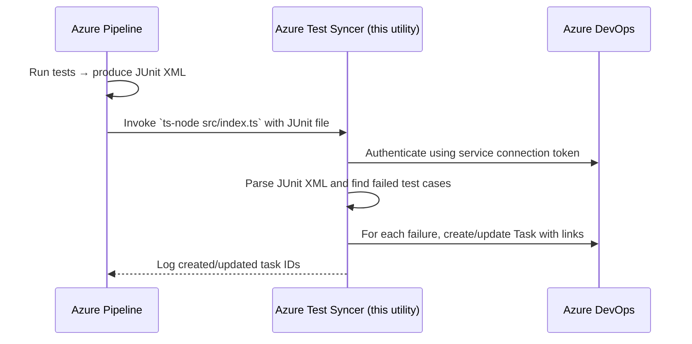
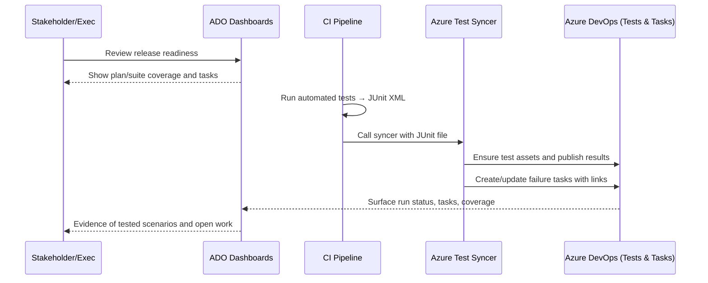
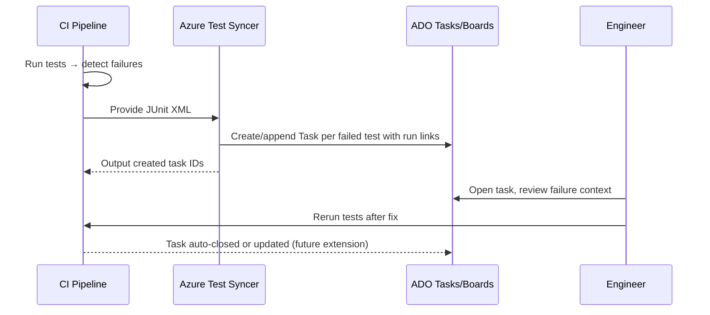
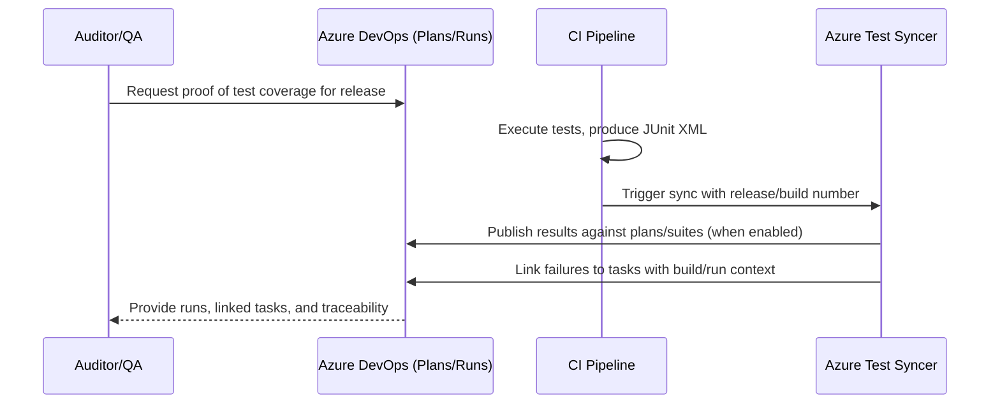
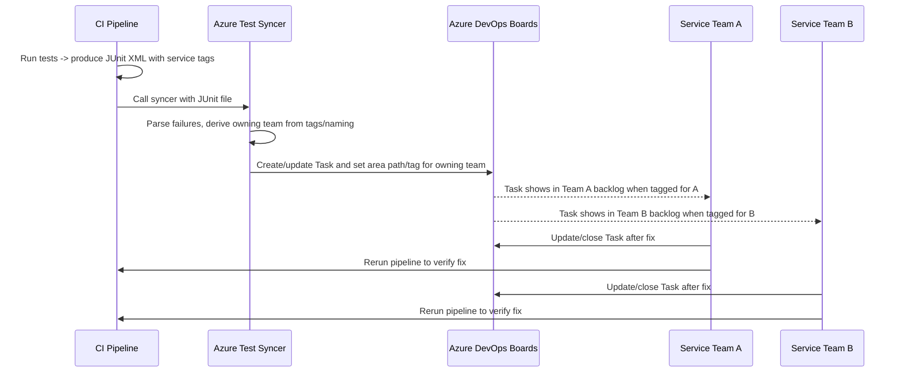

# Azure Test Syncer – Sequence (Simple View)

- Intent: Show the minimum flow from tests to tasks when the syncer runs.
- Benefits: Keeps pipeline and ADO in sync automatically; gives fast visibility on failures without manual steps.

## Stakeholder Traceability View

- Intent: Illustrate how leaders see coverage and open work in one place.
- Benefits: Provides release confidence with traceable evidence; reduces back-and-forth between engineering and stakeholders.

## Failure Triage Flow

- Intent: Show how failures become actionable tasks for engineers.
- Benefits: Faster triage with links to runs; avoids lost failures and speeds revalidation after fixes.

## Audit/Compliance Evidence

- Intent: Demonstrate how to generate auditable test evidence per release.
- Benefits: Easy proof of coverage and defect handling for audits without manual report building.

## Ownership Routing (Teams/Services)

- Intent: Show how failures are routed to the right team automatically.
- Benefits: Reduces triage overhead, improves accountability, and shortens mean time to resolution by sending work to the right backlog.

## Other Business Use Cases

- Release gating / quality bar  
  - Intent: Gate releases on test pass rates, coverage, and absence of critical open tasks.  
  - Benefits: Prevents risky deployments and enforces quality standards before shipping.

- Hotfix regression check  
  - Intent: Run targeted suites for hotfix branches and ensure failures create/close Tasks tied to the hotfix work item.  
  - Benefits: Minimises blast radius by validating only impacted areas and keeping remediation work traceable.

- UAT sign-off  
  - Intent: Capture UAT outcomes (manual or automated) and link them to release/change tickets with tasks for blockers.  
  - Benefits: Provides PMs and stakeholders a clear sign-off trail with actionable follow-ups.

- SLO/SLA reporting  
  - Intent: Run nightly/periodic suites on critical user journeys and surface trends plus failure tasks for ops/CS leadership.  
  - Benefits: Improves reliability accountability and visibility into customer-impacting regressions.
